<div align="center">



<a href="https://git.io/typing-svg">
  
</a>

<p>
  
  
  
</p>

<a href="https://github.com/hmzasaed/hmzasaed/raw/main/CV.pdf"></a>&nbsp;
<a href="https://portfolio-beta-gold-41.vercel.app/"></a>&nbsp;
<a href="https://linkedin.com/in/hmzasaedd"></a>&nbsp;
<a href="mailto:hhmza.m8@gmail.com"></a>

</div>


##  `whoami`

```python
class HamzaSaeed(AIEngineer):
    role       = "AI Engineer · Data Scientist · ML / DL Engineer"
    focus      = ["Retrieval-Augmented Generation", "Agentic AI", "Deep Learning", "LLM Apps"]
    languages  = ["Python", "TypeScript", "SQL", "Solidity"]
    frameworks = ["PyTorch", "TensorFlow", "scikit-learn", "LangChain", "LangGraph"]
    secondary  = "Blockchain & Smart Contract Engineering"
    philosophy = "ship the right tool, not the newest one"
```

I design, train and ship ML and deep learning models, from classical **scikit-learn** pipelines
to **CNNs, Transformers and Vision Transformers** in **PyTorch** and **TensorFlow**, for computer
vision and NLP. On the Generative AI side, I build **RAG systems** over vector search
(chunking, embeddings, hybrid retrieval, re-ranking, evaluation) and **autonomous multi-agent
pipelines** that reason, use tools and act on their own. I also build DApps with real on-chain
guarantees, from smart contract to frontend.


##  `projects --featured`

<table>
<tr>
<td width="50%" valign="top">

###  [AI Video Assistant](https://github.com/hmzasaed/video-agent-AI)
Paste a YouTube link or a local file and get a summary, action items, decisions and a searchable transcript. Then ask questions and get answers cited back to the video.


</td>
<td width="50%" valign="top">

###  [CineMind AI](https://github.com/hmzasaed/CineMind)
Movie intelligence where **the LLM is never the source of facts**. Every fact carries its source and a confidence score, and the model can only cite validated data through typed tools.


</td>
</tr>
<tr>
<td width="50%" valign="top">

###  [Multi-Agent Research Assistant](https://github.com/hmzasaed/research-assistant)
Four agents (Search, Reader, Writer, Critic) hand off to each other to research a topic, write a structured report and audit its quality.

<a href="https://research-assistant-5baxfflizugcnpcs3lqhx8.streamlit.app/"></a>


</td>
<td width="50%" valign="top">

###  [LinkedMind AI](https://github.com/hmzasaed/linkedin-agent-ai)
An agentic LinkedIn manager that learns your writing style and drafts posts, comments and outreach, with RAG over your resume, GitHub and past posts.


</td>
</tr>
<tr>
<td width="50%" valign="top">

###  [Face-ID Attendance System](https://github.com/hmzasaed/face_recog)
Privacy-first face identification and attendance tracking for consenting volunteers, built on a transparent OpenCV + HOG + SVM pipeline.


</td>
<td width="50%" valign="top">

###  [JARVIS AI](https://github.com/hmzasaed/old-jarvis)
A voice-driven desktop assistant with streaming chat that falls back across Mistral, Groq, OpenRouter and Ollama, plus a holographic 3D core that reacts to the conversation.


</td>
</tr>
</table>

###  Machine Learning & NLP

| Project | What it does | Stack |
|:--|:--|:--|
| [**Car Price Predictor**](https://github.com/hmzasaed/Car-Price-Predictor) | Scrapes PakWheels listings, engineers features and predicts used-car prices in Pakistan with a Random Forest model |   |
| [**Next Word Predictor**](https://github.com/hmzasaed/word_predict) | Suggests the five most likely next words using a trained LSTM language model |   |
| [**CineExtract**](https://github.com/hmzasaed/cineextract) | Pulls structured movie details (cast, budget, awards) out of unstructured text |   |

###  Web3 & Crypto Payments

| Project | What it does | Stack |
|:--|:--|:--|
| [**SeQureChain**](https://github.com/hmzasaed/Blockchian-Based-Evidence-Management-System-SequreChainDApp) · [live](https://sequre-chain-dapp.vercel.app) | Final-year project. Anchors digital evidence hashes on Ethereum Sepolia, stores files on IPFS and signs users in with MetaMask |   |
| [**CryptoShop**](https://github.com/hmzasaed/confirmo-paymentGateway) | Full-stack store with Confirmo crypto invoices, verified webhooks and idempotent payment handling |   |
| [**TechVerse Crypto Store**](https://github.com/hmzasaed/coingate-integration-webapp) | E-commerce storefront with CoinGate sandbox payments, Firebase auth and admin dashboards |   |


##  `skills --list`

<table>
<tr>
<td width="50%" valign="top">

####  Machine Learning
- Supervised & unsupervised learning
- Feature engineering & model selection
- Ensembles: XGBoost, Random Forest
- Evaluation, cross-validation, tuning

</td>
<td width="50%" valign="top">

####  Deep Learning
- CNNs, RNNs / LSTMs, Transformers, ViT
- Transfer learning & fine-tuning
- Computer vision & NLP
- Training loops, mixed precision, GPU

</td>
</tr>
<tr>
<td width="50%" valign="top">

####  RAG & LLMs
- Chunking, embeddings, vector search
- Hybrid retrieval & re-ranking
- Prompt engineering & structured output
- RAG evaluation & guardrails

</td>
<td width="50%" valign="top">

####  AI Engineering
- Multi-agent systems & tool calling
- LLM fine-tuning (LoRA / PEFT)
- Model serving with FastAPI & Docker
- Experiment tracking & MLOps

</td>
</tr>
</table>


##  `stack --all`

<div align="center">

**ML / Deep Learning**<br/>


<br/><br/>

**Generative AI & RAG**<br/>


<br/><br/>

**MLOps, Backend & Web**<br/>

<br/>


<br/><br/>

**Web3**<br/>


</div>


##  `git log --graph`

<div align="center">
<picture>
  <source media="(prefers-color-scheme: dark)" srcset="https://raw.githubusercontent.com/hmzasaed/hmzasaed/output/github-contribution-grid-snake-dark.svg"/>
  <source media="(prefers-color-scheme: light)" srcset="https://raw.githubusercontent.com/hmzasaed/hmzasaed/output/github-contribution-grid-snake.svg"/>
  
</picture>
</div>


<div align="center">

### `connect --with hamza_saeed`

<a href="mailto:hhmza.m8@gmail.com"></a>&nbsp;
<a href="https://linkedin.com/in/hmzasaedd"></a>&nbsp;
<a href="https://github.com/hmzasaed"></a>&nbsp;
<a href="https://t.me/h8mzx"></a>

<sub>Always happy to talk about RAG, agents, or anything that learns.</sub>

</div>
